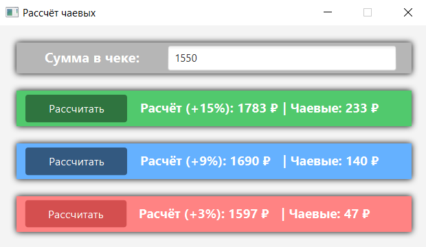
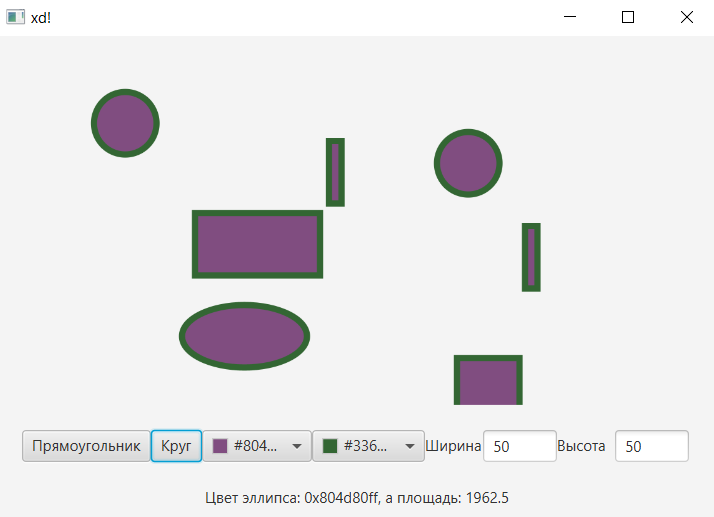

# Технологии программирования
___
## Task0 | Делегирование
### Условия задачи
Проблема. Получая чек в ресторане, Вы хотите дать "правильные" чаевые в зависимости от Вашего настроения - большие 15%,  обычные 10-9% или "мелочь"  3%

### Теоретическая справка
Наследование - распространенный способ расширения и многократного использования функциональности класса. Делегирование представляет собой более общий подход к решению задачи расширения возможностей поведения класса. Этот подход заключается в том, что некоторый класс вызывает методы другого класса, а не наследует их. Во многих ситуациях, не позволяющих использовать наследование, возможно применение делегирования.

### Результат

___
## Task1 | Абстрактный класс
### Условия задачи
Требуется написать программу, которая реализует следующую иерархию для отображения фигур и позволяет отобрать указанную на кнопке пользовательского интерфейса фигуру. 
Вариант фигур: круг, эллипс, прямоугольник, скругленный прямоугольник, квадрат.
### Теоретическая справка
Абстрактный класс - класс, выступающий в этой роли, представляет собой абстрактный суперкласс, в котором инкапсулирована общая логика связанных классов. Связанные классы расширяют этот класс. Таким образом, они могут наследовать его методы. Методы с одинаковыми сигнатурами и общей логикой для всех связанных классов помещаются в суперкласс, поэтому логика этих методов может наследоваться всеми подклассами данного суперкласса. Методы с зависящей от конкретного подкласса данного суперкласса логикой, но с одинаковыми сигнатурами, объявляются в абстрактном классе как абстрактные методы, тем самым гарантируя, что каждый конкретный подкласс будет иметь методы с такими же сигнатурами.
### Диаграмма классов

### Результат

